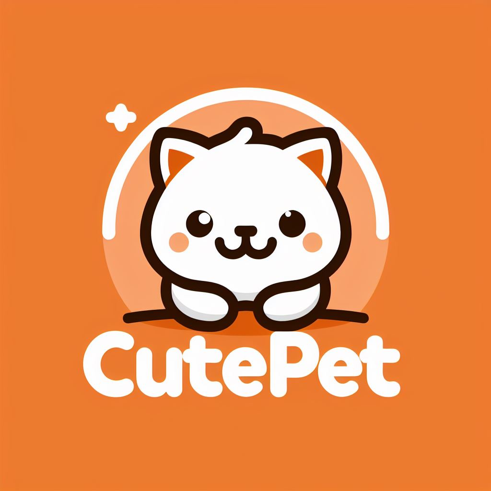

<div align='center'>
  
</div>

## 🏋️‍♂️ Sobre o Projeto

### Bem-vindo ao `CutePet`: Seu Sistema de Agendamentos para PetShop
### Desenvolvido com Tecnologias Avançadas

#### Criado com a combinação poderosa de ``Nuxt`` no ``Front-End`` e ``Nest.js`` no ``Back-End``, o ``CutePet`` é o seu melhor aliado para gerenciar os compromissos do seu petshop. Agende banhos, tosas ou consultas com facilidade, e tenha total controle sobre suas informações a qualquer momento.

### Uma Visão Clara dos Agendamentos
#### Desfrute de uma visão geral detalhada de todos os agendamentos, incluindo os em ``andamento``, ``cancelados`` ou ``concluídos``. Além disso, tenha uma contagem precisa dos tipos de agendamentos realizados, proporcionando uma gestão eficiente.

### Design Excepcional para uma Experiência Inigualável
#### Nosso design foi cuidadosamente criado para oferecer uma experiência de usuário incomparável. Explore as funcionalidades com facilidade e eficiência.

### Recursos que Facilitam a Gestão
- Agendamentos Simples: Realize agendamentos com apenas alguns cliques.
- Gerenciamento Flexível: Visualize e edite seus agendamentos conforme necessário.
- Controle Total: Remova agendamentos da fila com opções para marcar como ``concluídos`` ou ``cancelados``.

### Explore e Descubra
- Visão Geral dos Agendamentos: Tenha uma visão completa de todos os seus compromissos.
- Filtros Intuitivos: Organize os agendamentos de acordo com o dia do mês.
- Informações Úteis: Conheça as raças mais populares de cães e gatos para oferecer um serviço personalizado.

#

[Ver Projeto](https://cutepet-front-end.vercel.app/) 🚀

## 🎨 Visual do Projeto

### ***Web Layout***

 


### ***Mobile Layout***


## 🛠️ Tecnologias

💻 **Front-end**
- [Nuxt: 3.10.3](https://nuxt.com/)
- [Vue.js 3.4.19](https://vuejs.org/)
- [Typescript 5.4.2](https://www.typescriptlang.org)

📚 **Bibliotecas**
- [vcalendar](https://vcalendar.io/)
- [zod](https://vueuse.org/)

🎨 **Estilização**
- [shadcn-vue](https://www.shadcn-vue.com/)
- [tailwindcss](https://tailwindcss.com/docs/installation)
- [lucide](https://lucide.dev/)

🔋 **Versionamento e Deploy**
- [Git](https://git-scm.com)
- [Vercel](https://vercel.com/)

## ⚙️ Configurações e Instalação

```sh
# clonando o projeto
git clone https://github.com/renovatt/cutepet-front-end.git
```

```sh
# Instalando as dependências
npm install
```

```sh
# Compilar e abrir o programa para desenvolvimento
npm run dev
```

```sh
# Compilar e minificar para produção
npm run build
```

🚀 **Como contribuir?**

- Siga-me no GitHub para oferecer suporte.
- Dê uma estrela ao projeto.
- Conecte-se comigo no LinkedIn para expandir nossa rede e curta o projeto.

<br>

🧑‍💻 **Criado por**
[@renovatt](https://www.linkedin.com/in/renovatt/)